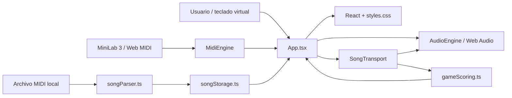

# MiniLab Playground — arquitectura

Este documento explica las fronteras entre UI, entrada MIDI, audio, modo canción y persistencia. El resumen operativo está en `docs/PROJECT_CONTEXT.md`; los comandos y la validación están en `docs/DEVELOPMENT.md`.

## Dirección del producto

MiniLab Playground se comporta como un instrumento digital pequeño, no como una estación de trabajo. El gesto principal es conectar, elegir un timbre, tocar y recibir una respuesta inmediata. La pantalla principal mantiene el teclado como elemento central y revela complejidad solo cuando una acción la necesita.

Principios que deben mantenerse:

- local-first y sin backend obligatorio;
- audio y transporte independientes del ciclo de render de React;
- MIDI convertido a eventos semánticos antes de llegar a la UI;
- canciones importadas localmente y persistidas en el dispositivo;
- controles secundarios compactos y accesibles;
- soporte explícito de español/inglés y claro/oscuro.

## Flujo de alto nivel



## Capas y responsabilidades

### `src/App.tsx`

Es el coordinador de la aplicación. Mantiene estado de idioma, tema, instrumento seleccionado, dispositivo MIDI, teclado activo, BPM, grabación, biblioteca y sesión de canción. Conecta callbacks de `MidiEngine`, `AudioEngine`, `SongTransport` y `SongGame`.

No debe convertirse en el lugar donde se implementan algoritmos de scheduling o parsing. Cuando una regla pueda probarse sin DOM, debe ir a `src/lib`.

### `src/components/SongGame.tsx`

Renderiza la superficie de juego: pista objetivo, vista falling/piano-roll, transporte, velocidad, puntuación y rango visible. Recibe datos y callbacks; no es dueño del reloj ni de la persistencia.

### `src/types.ts`

Es la fuente común de contratos:

```ts
ImportedSong -> tempos + tracks[] -> SongTrack -> SongNote[]
MidiNoteInput -> scoring -> Judgment
GameSession -> estado visual/persistible del modo canción
```

Cambiar estos contratos requiere revisar parser, storage, transporte, scoring, componente de juego y pruebas.

### `src/lib/midiEngine.ts`

Es la única capa que conoce la representación binaria de mensajes MIDI. Expone:

```ts
onNoteOn(note, velocity, channel, receivedAt)
onNoteOff(note, channel)
onPad(pad, pressed)
onKnob(cc, value)
onLog(event)
onDevices(inputs)
```

El tiempo de recepción de una nota usa `performance.now()`. La selección de dispositivo recuerda `minilab-last-device`, prefiere MiniLab/Arturia y observa `onstatechange`.

### `src/lib/minilabMapping.ts`

Mantiene separado el mapping semántico del parser MIDI. El mapping inicial acepta:

- encoders: `74, 71, 76, 77, 93, 18, 19, 16`;
- pads: CC `102–109`;
- faders observados: `82, 83, 85, 17`.

Estos valores deben confirmarse con el monitor MIDI cuando se pruebe un preset o firmware diferente.

### `src/lib/audioEngine.ts`

Es dueño de un único `AudioContext`, el bus master, la salida de grabación y las voces activas/programadas. Soporta:

- voces polifónicas con oscilador, filtro y envolvente;
- `noteOn`/`noteOff` para el modo libre;
- `scheduleNote`/`stopScheduled` para acompañamiento;
- `triggerClick` para metrónomo;
- `MediaStreamAudioDestinationNode` para `MediaRecorder`.

El contexto se inicializa/resume después de una interacción del usuario para respetar autoplay policy. Un motor de loops futuro debe compartir este contexto, no crear uno por componente.

### `src/lib/songParser.ts`

Usa `@tonejs/midi` para convertir un `File` MIDI en `ImportedSong` plano. Normaliza:

- nombre y metadata de archivo;
- tempos y firma de tiempo;
- pistas con notas;
- nota MIDI, velocidad 1–127, inicio, duración y canal;
- programa/instrumento y percusión.

Las pistas sin notas se descartan. `pickTargetTrack` puntúa registro, cantidad de notas, variedad de alturas y notas cortas; excluye percusión salvo que no exista otra pista válida.

### `src/lib/songStorage.ts`

Usa IndexedDB con base `minilab-playground` y store `songs`. El key path es `song.id`. Guarda `ImportedSong` y preferencias de pista/vista/velocidad. Si IndexedDB falla, usa `minilab-song-library` en `localStorage`.

Una migración futura debe preservar canciones existentes y documentar el cambio de versión de object store.

### `src/lib/songTransport.ts`

Es el reloj lógico del modo canción y reutiliza `AudioEngine`.

- `load` fija canción y pista objetivo.
- `play` ancla posición a `AudioContext.currentTime`.
- `pause` reancla, detiene notas programadas y conserva posición.
- `stop` vuelve a cero.
- `restart` detiene y reproduce desde el inicio.
- `setSpeed` limita velocidad a `0.5–1.5` y reancla si está reproduciendo.
- un timer de 25 ms actualiza snapshots y programa notas con look-ahead.
- solo programa pistas distintas de la pista objetivo.

El intervalo despierta al scheduler, pero el tiempo musical se calcula con `AudioContext.currentTime`. No usar la hora de React como fuente de verdad.

### `src/lib/gameScoring.ts`

Calcula un rango inicial central y pliega notas por octavas para el teclado de 25 teclas. Conserva la nota original en `SongNote` y agrega `playableNote` solo a la vista jugable.

`judgeInput` busca la nota de la misma altura jugable dentro de `±0.15 s`, evita IDs ya juzgados y combina:

- 70% sincronización;
- 30% velocidad MIDI;
- velocidad neutral para `source: 'virtual'`.

Las etiquetas son `Perfecto`, `Bien`, `Acierto` y `Fallo`.

## Audio, datos y UI

```text
MIDI bytes / keyboard event
        ↓
MidiNoteInput { note, velocity, channel, receivedAt, source }
        ↓
AudioEngine.noteOn() + gameScoring.judgeInput()
        ↓
activeNotes / score / combo / accuracy
        ↓
React UI + keyboard + SongGame
```

Para una canción:

```text
File.mid
  ↓ parseMidiFile
ImportedSong
  ↓ songStorage.save/list
SongTransport.load/play
  ├─ acompaña pistas restantes → AudioEngine.scheduleNote
  ├─ actualiza posición → SongGame
  └─ recibe entrada del usuario → gameScoring
```

## Persistencia

| Dato | Almacenamiento | Clave/base |
| --- | --- | --- |
| idioma | `localStorage` | `minilab-language` |
| tema | `localStorage` | `minilab-theme` |
| BPM | `localStorage` | `minilab-bpm` |
| último dispositivo | `localStorage` | `minilab-last-device` |
| canciones | IndexedDB | `minilab-playground` / `songs` |
| fallback canciones | `localStorage` | `minilab-song-library` |

`index.html` aplica el tema antes de montar React. `App.tsx` actualiza `document.documentElement.dataset.theme` y el `meta[name="theme-color"]` al cambiarlo. Las reglas del modo claro están al final de `styles.css` para ganar especificidad sobre la base oscura.

## Entrada del launcher

`iniciar_minilab.vbs` ejecuta el BAT con ventana oculta. `iniciar_minilab.bat`:

1. ancla el directorio a `%~dp0`;
2. hace `git fetch` y solo hace `git pull --ff-only` si `HEAD` está atrasado respecto de `origin/main` y no adelantado;
3. ejecuta `npm ci` si faltan dependencias o cambian los manifests;
4. inicia Vite en `127.0.0.1:5173` si no hay listener;
5. espera HTTP 200 en `/`;
6. abre el navegador y registra el resultado en `logs/`.

El launcher no debe usar comandos destructivos ni sobreescribir cambios locales.

## Límites y decisiones futuras

### Loop engine

Todavía no hay captura de capas MIDI editable. El siguiente diseño debe mantener un transporte independiente de React, convertir `AudioContext.currentTime` a beats, cuantizar de forma conservadora y persistir capas en IndexedDB.

### Audio y formatos

La grabación actual captura el master en el formato disponible por `MediaRecorder`, normalmente WebM. WAV/PCM fiable, samples y exportación offline quedan para otra etapa.

### YouTube Music

No existe integración en el código actual. Una futura búsqueda/reproducción debe usar APIs y reproductor oficial visible, con credenciales y privacidad documentadas. No se debe descargar, cachear, separar ni usar un reproductor oculto para convertir audio de YouTube en notas.

### Hardware

El mapping es una primera hipótesis y debe validarse con mensajes reales del MiniLab 3. No publicar un mapping como definitivo solo porque compile o porque funcione con un preset.
